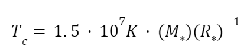
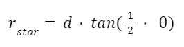
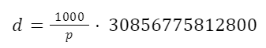

# Research and Data analysis

## Original Ideation

The goal of this research project is to determine the net energy requirement for fusion reactions to occur.

### System Net Energy Requirement for Fusion (SNER)

SNER is the total amount of energy present in a system (as a ratio of energy per atom) in order for fusion to occur.
This includes thermal energy, gravitational pressure, kinetic energy, and other forms of energy.

SNER varies slightly from the Coulomb barrier in that it is an amount of energy found through measurements
taken from stellar bodies, therefore, it is closer to the practical energy requirements for fusion to occur.

As an example, the energy required to overcome the Coulomb barrier for the fusion of two deuterium atoms 
is approximately 400 keV, but in practice the energy required is closer to 40 keV. That value of 40 keV is
the SNER for the fusion of two deuterium atoms.

## Research Objective

The objective of this research project is to determine the SNER of stellar cores with varying levels
of gravitational pressure, temperature, atomic mass, and other factors.

From this data, it can be extrapolated how different non-temperature energy forms are required to
ensure that a certain temperature is required for fusion to occur. That is to say, how much
initial energy is required to lower the fusion temperature to a certain level.

## Research Questions

1. What is the SNER of a stellar core?
2. How does gravitational pressure affect the temperature required for fusion to occur?
3. Extrapolate a formula of SNER based on atomic mass.

## Research Hypothesis

SNER will be constant and will be the result of an inverse proportion of
gravitational pressure, temperature, and other energy forms. Where an
increase in temperature leads to a decrease in gravitational force and vice versa.

That would mean that higher non-temperature energy forms **lower** the temperature required for fusion to occur.

## Research Methodology

Research will be conducted in 3 parts:

1. Data Collection
2. Data Analysis
    1. Collect necessary data for calculation of internal core temperature
    2. Using core temperature, calculate gravitational pressure using the concept of hydrostatic equilibrium and the
       ideal gas law
    3. Calculate SNER using the calculated gravitational pressure and core temperature
        1. Specifically, thermal energy plus gravitational pressure or something of that sort
3. Data Visualization and Extrapolation
   1. Visualize data using graphs with gravitational pressure on the x-axis and temperature on the y-axis.
   2. Extrapolate a formula for SNER based on a proportion of gravitational pressure and temperature
   3. Extrapolate a general formula for SNER based on all factors (gravitational pressure, temperature, etc.)

## Research Resources
1. A Python Environment Capable of Running Jupyter Notebooks
2. An account with the European Space Agency in order to access the Gaia archive (To handle data processing via ADQL)
3. A program to run Jupyter Notebooks, such as:
   1. Jupyter Notebook/Lab via the command line
   2. A compatible IDE such as Visual Studio Code or PyCharm Professional (This research was conducted using PyCharm Professional under an educational license)

## Data Collection
The first equation we need is the equation for stellar core temperature, which is as follows:

[//]: # (T_c = &#40;\frac{G}{k}&#41;\times&#40;\frac{Mm_a}{R_{avg}}&#41;)

Where:

`T sub c` is the stellar core temperature

`G` is the gravitational constant

`k` is the Boltzmann constant

`M` is the mass of the star

`m sub a` is the average atomic mass of the star

`R sub avg` is the average radius of the star

However, a new formula derived from a solution to the Lane-Emden equation is used to calculate the stellar core temperature.
This equation not requiring the average atomic mass of the star, makes it more desirable to the former formula.

The equation is as follows:

Where:

`T sub c` is the stellar core temperature

`M sub *` is the mass of the star

`R sub *` is the radius of the star

The second equation we need is the equation for gravitational pressure, which is as follows:

[//]: # (P_g = \frac{GM^2}{R^4})

Where:

`P sub g` is the gravitational pressure

`G` is the gravitational constant

`M` is the mass of the star

`R` is the radius of the star

### Stellar Radius Collection
Initially, stellar radii were collected from the [VisieR Catalogue of Stellar Diameters dataset](https://cdsarc.cds.unistra.fr/viz-bin/cat/II/224)
This dataset contains the radii of 9733 stars.

However, once relating with stellar mass data, there were far too few entries in the resulting dataset to be useful. (Around a few hundred).

An alternative method of collecting stellar radii was needed. Using trigonometry, [LDD (Limb Darkening Distance) data](https://cdsarc.cds.unistra.fr/viz-bin/cat/II/346), 
as well as parallax angles to measure distances
provided by the Gaia mission's Data Release 3, stellar radii were calculated using the following equation:

[//]: # (R = \frac{LDD}{\tan\theta})

Where:

`d` is the distance to the star, calculated using the parallax angle:

`θ` is the LDD angle in radians, provided by the LDD dataset from VizieR

[//]: # (d = \frac{1000}{p} * 30856775812800)

Where:

`p` is the parallax angle in milli-arcseconds

**It's very important to note that this data were curated to include
ONLY main-sequence stars for the purposes of temperature calculations** 

### Stellar Mass Collection
Stellar Radii were collected from the [Gaia DR3 Part 6 Dataset on VizieR](https://cdsarc.cds.unistra.fr/viz-bin/cat/I/360)
This dataset contains the masses of 218,936,915 non-single stars. 
After collating with the stellar radius dataset (matching based on a cone search), the dataset was reduced to only 
1,858 stars.

### Stellar Temperature Calculation
Stellar Temperature was calculated using the equation for stellar core temperature, using the stellar mass and radius.

The formula is as follows:

Where:

`T sub c` = Stellar core temperature (in Kelvin)

`M sub *` = Stellar mass (in solar masses)

`R sub *` = Stellar radius (in radii)

### Error Calculation
Errors for radius and temperature were calculated. Formulae and implementations can be seen in `gaia_collation.ipynb`

## Data Analysis
Now that we have collected the necessary data, we can calculate the gravitational pressure and from that
determine SNER.

### Gravitational Pressure Calculation
We can determine the gravitational pressure using the following formula:

Where:

`P sub g` is the gravitational pressure

`G` is the gravitational constant

`M` is the mass of the star

`R` is the radius of the star

## Data Visualization and Extrapolation
Note to self: I'm probably going to try to extrapolate a formula for SNER using a known energy requirement for fusion
such as D-D fusion (since that is a main part of the Proton-Proton chain).

## Research Results

## Research Conclusion

## Research Limitations
### Data Limitations
The amount of data was limited due to the nature of data collation. 
The Gaia DR3 dataset was comprehensive; however, it did not contain the necessary
mass and radius data. Other datasets had to be used to supplement the data.

This process (using cone searchers to match Gaia data with other datasets) condensed the datasets
down to a very small number of stars (1,858 stars), comparatively.

### Data Quality
Since cone-searches were used to cross-reference data, there is a possibility that the 
data for star mass/radii are mis-matched with the Gaia data.

Also, mathematical formulae, while providing a good estimate, are not necessarily accurate.
The formula for temperature is a good *estimate* of the temperature of a **main sequence**
star. Having more precise data would allow for more accurate calculations.

However, for the purpose of this research a good estimate should suffice,
as the goal is to determine enough of a relation to do predictions for force/temperature 
requirements for fusion on Earth.

## Research Future Work
### Higher Quality Data
While mathematical methods to determine such data as radii and more importantly temperature exist, they are not necessarily extremely accurate.

They provide a very strong basis for generalization, but the degree of error may provide inaccuracies. Due limited data access, 
such mathematical functions must be taken to forward this research.

### More Data
It is a standard rule in data science that the more data one possesses, the more accurate the resulting model will be.

In tandem with higher quality data, more data will allow for a more accurate model to be created.

## Acknowledgements
I would like to thank first and foremost the wonderful researchers and data curators at the [Gaia mission](https://www.cosmos.esa.int/web/gaia/home) for providing
excellent data and astronomical analysis tools including the [Gaia Archive](https://archives.esac.esa.int/gaia/) where
I was able to host and manipulate my data with ease using ADQL.

Secondly, I would like to thank the [VizieR](https://vizier.u-strasbg.fr/viz-bin/VizieR) team for providing a wonderful
data hosting service for astronomers and researchers alike, allowing me to access all the necessary data to make this project possible.