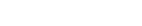
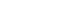

# Research and Data analysis

## Original Ideation

The goal of this research project is to determine the net energy requirement for fusion reactions to occur.

### System Net Energy Requirement for Fusion (SNER)

SNER is the total amount of energy present in a system in order for fusion to occur.
This includes heat energy, gravitational pressure, kinetic energy, and other forms of energy.

SNER varies slightly from the Coulomb barrier in that it is an amount of energy found through measurements
taken from stellar bodies, therefore, it is closer to the practical energy requirements for fusion to occur.

As an example, the energy required to overcome the Coulomb barrier for the fusion of two deuterium atoms 
is approximately 400 keV, but in practice the energy required is closer to 40 keV. That value of 40 keV is
the SNER for the fusion of two deuterium atoms.

## Research Objective

The objective of this research project is to determine the SNER of stellar cores with varying levels
of gravitational pressure, temperature, atomic mass, and other factors.

From this data, it can be extrapolated how different non-temperature energy forms are required to
ensure that a certain temperature is required for fusion to occur. That is to say, how much
initial energy is required to lower the fusion temperature to a certain level.

## Research Questions

1. What is the SNER of a stellar core?
2. How does gravitational pressure affect the temperature required for fusion to occur?
3. Extrapolate a formula of SNER based on atomic mass.

## Research Hypothesis

If atomic mass remains the same, then SNER will be constant to an inverse proportion of
gravitational pressure, temperature, and other energy forms.

That would mean that higher non-temperature energy forms lower the temperature required for fusion to occur.

## Research Methodology

Research will be conducted in 3 parts:

1. Data Collection
2. Data Analysis
    1. Collect necessary data for calculation of internal core temperature
    2. Using core temperature, calculate gravitational pressure using the concept of hydrostatic equilibrium and the
       ideal gas law
    3. Calculate SNER using the calculated gravitational pressure and core temperature
3. Data Visualization and Extrapolation
    1. Visualize data using graphs with gravitational pressure on the x-axis, atomic mass on the y-axis,
       and temperature as the z-axis
    2. Visualize SNER using graphs with atomic mass on the x-axis and SNER on the y-axis, since it was hypothesized
       should increase/decrease depending on atomic mass.
   3. Extrapolate a formula for SNER based on atomic mass
   4. Extrapolate a formula for SNER based on a proportion of gravitational pressure and temperature
   5. Extrapolate a general formula for SNER based on all factors (atomic mass, gravitational pressure, temperature, etc.)

### Data Collection
The first equation we need is the equation for stellar core temperature, which is as follows:

[//]: # (T_c = &#40;\frac{G}{k}&#41;\times&#40;\frac{Mm_a}{R_{avg}}&#41;)

Where:
T sub c is the stellar core temperature
G is the gravitational constant
k is the Boltzmann constant
M is the mass of the star
m sub a is the average atomic mass of the star
R sub avg is the average radius of the star

The second equation we need is the equation for gravitational pressure, which is as follows:

[//]: # (P_g = \frac{GM^2}{R^4})

Where:
P sub g is the gravitational pressure
G is the gravitational constant
M is the mass of the star
R is the radius of the star

#### Stellar Radius Collection
Stellar Radii were collected from the [VisieR Catalogue of Stellar Diameters dataset](https://cdsarc.cds.unistra.fr/viz-bin/cat/II/224)
This dataset contains the radii of 9733 stars.

#### Stellar Mass Collection

[//]: # (I don't have a dataset for this yet)

#### Stellar Atomic Mass distribution

[//]: # (I don't have a dataset for this yet)

### Data Analysis

### Data Visualization and Extrapolation
Note to self: I'm probably going to try to extrapolate a formula for SNER using a known energy requirement for fusion
such as D-D fusion (since that is a main part of the Proton-Proton chain).

## Research Results

## Research Conclusion

## Research Limitations

## Research Future Work
